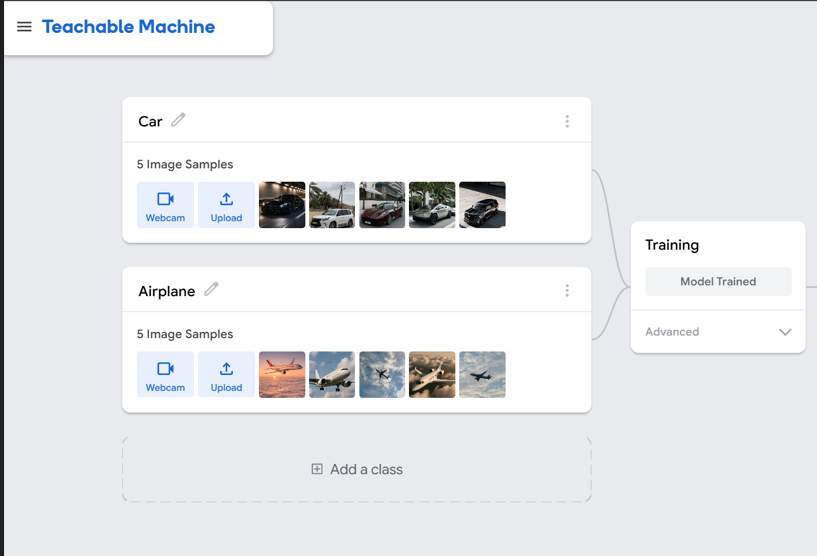
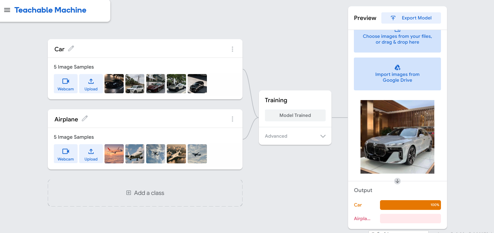
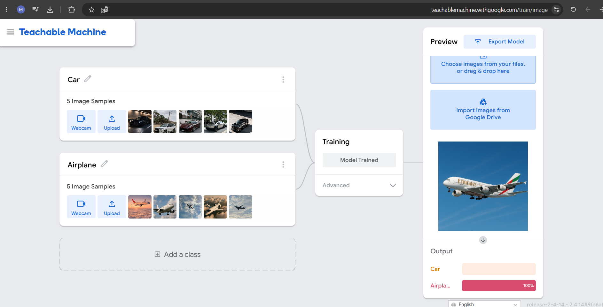
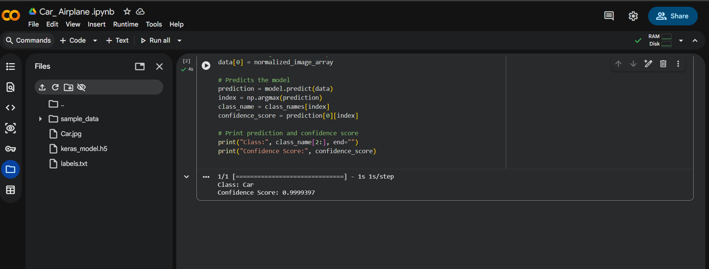

# 🚗✈️ Car vs Airplane Image Classification

## 📌 Overview
This project is an AI model that classifies images into two categories: Car and Airplane.

The model was trained using Teachable Machine and tested using Python to verify the accuracy of the predictions.

---

## 🧠 Step 1: Data Collection
We collected images for two classes:
- Car 🚗
- Airplane ✈️

The images include different angles and backgrounds to improve model performance.

---

## 🧠 Step 2: Model Training
The images were uploaded to Teachable Machine and the model was trained.

- Created two classes: Car and Airplane  
- Uploaded training images  
- Trained the model  

---

## 🧠 Step 3: Model Export
After training, the model was exported using:
- TensorFlow  
- Keras format  

Generated files:
- keras_model.h5  
- labels.txt  

---

## 🧠 Step 4: Model Testing
The model was tested using  ( Google Colab).

Steps:
- Loaded the trained model  
- Input a test image  
- Generated prediction and confidence score  

Example output:
